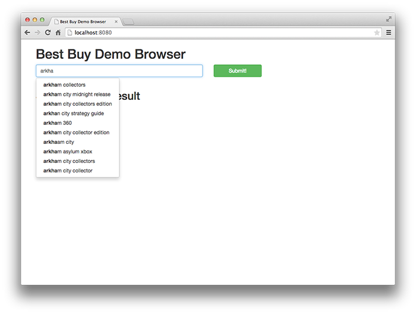
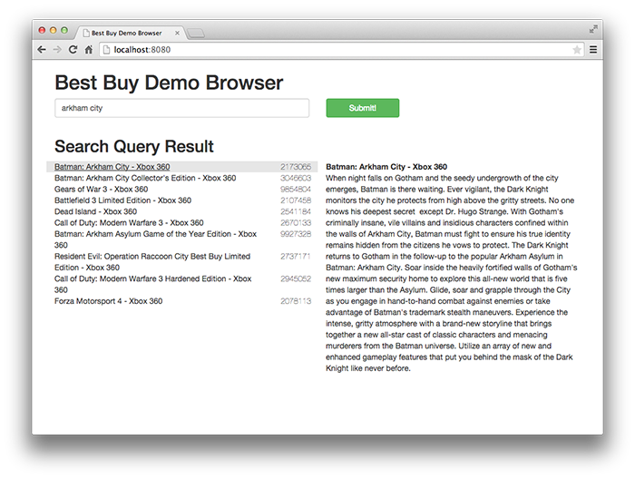
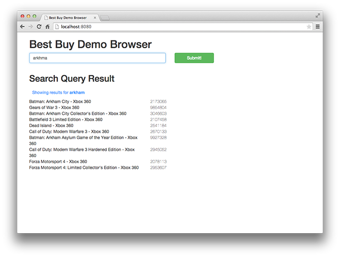

This is the right place to see Antelope in action in a simple web application.

## Setup ##
As a prerequisite, please be sure to complete the steps in
section titled [Download necessary files](demo-best-buy.html#download-necessary-files)
from the document [Getting Started with the Best Buy Demo](demo-best-buy.html). These
instructions will guide you through downloading data files and configuring
environment variables.

## Running the web demo ##

Within sbt execute the following commands to generate training data

    project demo-best-buy-web
    container:start

Now point your web browser to [http://localhost:8080](http://localhost:8080).

This web demo implements typeahead, give it a try:

Click on results to see the game descriptions:

Try making simple typos:

To shut down the web application execute the stop command within sbt

    container:stop